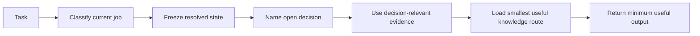

<div align="center">


# Marketing Practitioner

**Decision-first marketing for AI agents.**  
Know what to resolve, what to preserve, and what evidence can actually change the answer.

[](#status-and-scope)
[](LICENSE)
[](#)
[](skills/marketing-practitioner/SKILL.md)
[](https://skills.sh/quocbao201104/marketing-practitioner)

**[Quick start](#quick-start) · [Why it exists](#why-it-exists) · [How it works](#how-it-works) · [Host compatibility](#host-compatibility) · [Research](#research-and-verification) · [Contributing](#contributing)**

<sub><strong>Evidence → Open decision → JIT knowledge → Minimum useful output</strong></sub>

</div>

---

> Marketing agents are already fluent. The harder problem is knowing **what not to reopen**, **what evidence is enough**, and **which knowledge is actually relevant now**.

Marketing Practitioner is an installable Agent Skill for marketing work that needs stronger decision discipline: research, diagnosis, positioning, commercial design, writing, platform adaptation, commerce, paid delivery, localization, testing, and learning — without treating all of those as one giant workflow.

<table>
<tr>
<td width="25%" valign="top"><strong>Preserve state</strong><br><br>Approved decisions stay settled unless the current job exposes a real contradiction or gap.</td>
<td width="25%" valign="top"><strong>Bound claims</strong><br><br>Copy, diagnosis, and recommendations stay inside the evidence actually available.</td>
<td width="25%" valign="top"><strong>Route selectively</strong><br><br>Knowledge is loaded by decision dependency, not because a platform or artifact was named.</td>
<td width="25%" valign="top"><strong>Learn carefully</strong><br><br>Results retain what they proved — without silently upgrading attribution into causality.</td>
</tr>
</table>

## Quick start

```bash
npx skills add quocbao201104/marketing-practitioner
```

Then give the agent three things:

1. what you need done **now**;
2. the facts, evidence, and already-approved decisions you have;
3. where the result will be used, if that changes the answer.

```text
Use Marketing Practitioner.
The positioning below is approved. Do not reopen it.
Write a LinkedIn post for people who already follow the company.
Do not add product claims that are not in the facts.
```

No internal vocabulary is required. “Help me decide which customer group to focus on” is enough; you do not have to say ICP. The optional [Task Specification Guide](TASK-SPECIFICATION-GUIDE.md) can compile rough notes into a smaller spec without inventing missing facts.

Clone the full repository if you want to inspect or extend the skill:

```bash
git clone https://github.com/quocbao201104/marketing-practitioner.git
```

The governing runtime contract is [`skills/marketing-practitioner/SKILL.md`](skills/marketing-practitioner/SKILL.md).

## Why it exists

A fluent answer can still be the wrong marketing action.

| Common agent failure | What this skill does instead |
| --- | --- |
| Invent a plausible product claim | Keep claims inside supplied or supported evidence |
| Treat a handful of interviews as market prevalence | Separate qualitative recurrence from population claims |
| Rewrite creative because CPA moved | Diagnose before selecting the intervention |
| Load a TikTok playbook because the prompt says “TikTok” | Route by decision dependency, not by noun |
| Reopen approved positioning while writing copy | Freeze resolved state unless it becomes contradictory, stale, or insufficient |
| Turn attribution into causality | Preserve what a result did — and did not — prove |

The distinctions the runtime is designed to preserve are deliberately explicit:

```text
observation ≠ interpretation ≠ hypothesis ≠ decision
qualitative recurrence ≠ population prevalence
attribution ≠ incrementality ≠ causality
paid relationship ≠ paid delivery
reported metric ≠ optimization-eligible signal
displayed commercial state ≠ universal authoritative state
platform name ≠ reason to load that platform
local evidence ≠ country-wide behavioral rule
```

It has no authority to invent product, financial, legal, operational, sales, platform, or customer facts. Provider-controlled rules are just-in-time dependencies, not timeless growth laws stored in the repo.

## How it works

The skill starts from the current job, not from a predefined marketing funnel.



Seven runtime jobs are recognized:

`WRITE` · `DECIDE` · `DIAGNOSE` · `RESEARCH / UNDERSTAND` · `ADAPT` · `TEST` · `LEARN`

A topic, artifact type, or platform name is not a job. A caption with an approved message stays a writing task. A price already fixed at `$29` stays frozen while the page is written. Paying a creator to publish is not automatically paid media. A CPA rise after a bidding change starts as diagnosis, not as a creative rewrite.

### What it can help with

| Decision and research | Expression and adaptation | Distribution and learning |
| --- | --- | --- |
| Customer evidence<br>Audience prioritization<br>Positioning<br>Commercial design<br>Offer reasoning | Copy and critique<br>Landing pages<br>Email<br>Platform adaptation<br>Scoped localization | Search and discovery<br>Paid media<br>Commerce listings<br>Testing<br>Result interpretation |

Specialist knowledge is loaded only when a concrete decision needs it. The [handbook map](skills/marketing-practitioner/handbook/README.md), [platform modules](skills/marketing-practitioner/platforms/README.md), and [`adaptations/`](skills/marketing-practitioner/adaptations/) are navigation surfaces, not a required reading sequence.

## Host compatibility

Marketing Practitioner is portable, but runtime behavior is not identical across hosts. The host decides whether the skill is discovered and loaded, how much working context survives, whether memory persists across sessions, and which files, tools, or integrations the agent can use.

| Host | Durable context to use |
| --- | --- |
| **Claude Code** | `CLAUDE.md` / project memory and resumable sessions |
| **ChatGPT** | Projects, project files/instructions, and project memory |
| **Cursor** | Project Rules or `AGENTS.md`; keep reusable context in version-controlled rules |
| **Codex** | `AGENTS.md` / repository instructions and checked-in project state |

Use the host's native persistence features when available, but do not rely on chat history alone for important facts, constraints, approved decisions, or evidence boundaries. Keep those explicit in the current task context or project files.

**Host memory improves continuity; it does not replace the skill contract.** `SKILL.md` and the governed repository knowledge remain the portable source of behavior. The skill also cannot force a host to activate it: if the runtime never loads the skill, you get ordinary model behavior.

## Under the hood

Large knowledge is addressed by logical IDs in [`routing-index.json`](skills/marketing-practitioner/routing-index.json). Headings and file paths are implementation details.

When the host can run helpers, [`get-knowledge.py`](skills/marketing-practitioner/scripts/get-knowledge.py) resolves one route or one evidence source without reading the rest of the ledger:

```bash
python skills/marketing-practitioner/scripts/get-knowledge.py email.send-decision
python skills/marketing-practitioner/scripts/get-knowledge.py adapt-localization.relationship-realization
python skills/marketing-practitioner/scripts/get-knowledge.py --source PM01
```

If helper execution is unavailable, the same index remains the address table: read the smallest feasible section, or degrade to the smallest target file, rather than loading an entire chapter.

The current index validates at **252 routes / 214 evidence sources**. Evidence files state what a source **supports** and **does not support**; those bounds are part of claim control.

Shared architecture expands only when a decision-relevant failure cannot be repaired locally without material distortion. Research under [`research/`](research/) keeps theory freezes, audits, and rejected expansions out of the runtime until they survive that bar.

### Scoped local adaptation

Local adaptation follows the same rule. [`adaptations/`](skills/marketing-practitioner/adaptations/) contains scoped evidence that can specialize an **already-open decision owned elsewhere**; it is not a country-profile layer, cultural encyclopedia, or precedence engine.

The first canonical contribution, `VN-LANG-REL-01`, specializes Vietnamese relationship-sensitive language realization through `adapt-localization.relationship-realization` without inferring the underlying relationship, turning age into an address lookup table, or treating Vietnam as an activation key. See the [local-adaptation contribution contract](skills/marketing-practitioner/adaptations/README.md) and [Vietnamese reference unit](skills/marketing-practitioner/adaptations/localization.md).

## Repository map

```text
skills/marketing-practitioner/
  SKILL.md                  governing runtime controller
  agents/openai.yaml        optional UI metadata and explicit invocation starter
  routing-index.json        logical knowledge address table
  handbook/                 governed practitioner knowledge
  adaptations/              scoped local decision specializations
  platforms/                scoped social and commerce modules
  references/               evidence ledgers and bibliography
  scripts/                  deterministic routing checks

research/                   theory lineage and rejected hypotheses
evals/                      adversarial cases, smokes, and behavioral harness
scripts/verify.ps1          sole local/CI verification entrypoint
```

## Research and verification

The local and CI gate is:

```powershell
.\scripts\verify.ps1
```

It validates the package with the repository validator and the installed Codex validator when discoverable, checks 58 routing mechanics and **252 routes / 214 evidence sources**, runs the Pressure Discovery and behavioral harness tests, and verifies UTF-8/generated-artifact hygiene.

Repository evaluation is intentionally reported with its limitations:

- A frozen **48-run behavioral pilot** used 12 cases, no-skill baseline vs current skill, `gpt-5.6-terra`, medium reasoning.
- It produced eight both-pass pairs, three operationally invalid pairs, and one unresolved pair.
- It **did not show a paired quality advantage**. Review was condition-blind but not independently human-adjudicated.
- A controller 75% smaller than the installed one was evaluated on the same frozen cases and **not promoted** because unverified skill activation rose from 3/24 to 7/24.

See the [current-skill pilot](evals/behavioral/reports/current-skill-pilot-v1.md) and [compact challenger report](evals/behavioral/reports/compact-challenger-v1.md).

If the skill makes a poor decision, overcomplicates a simple task, misses supplied evidence, reopens resolved state, chooses the wrong knowledge path, behaves inconsistently, or produces an unexpectedly useful result, [open a behavior report](https://github.com/quocbao201104/marketing-practitioner/issues/new?template=behavior-report.yml). Include sanitized context, expected vs observed behavior, model/runtime, skill version, and whether it reproduces.

## Status and scope

Current release: **v1.1.0 — Scoped Local Adaptation**.

v1.0.0 remains the stable core compatibility baseline: the seven jobs, resolved-state behavior, logical knowledge IDs, owner boundaries, and source/claim discipline remain compatibility-sensitive. v1.1.0 adds a bounded extension contract for community-maintained local adaptation knowledge plus the first canonical Vietnamese relationship-realization unit.

The first reference implementation received `PASS_WITH_LOCAL_REPAIRS` at its frozen review head and the two bounded repairs were implemented. A post-repair independent re-review was not performed, so the reference unit remains explicitly `review_state: provisional`.

Stable does not mean complete. This is **not** a prompt pack, conversion-formula library, generic agent framework, cultural encyclopedia, or back-office automation system. It does not own product roadmap, finance, legal advice, CRM, or private platform mechanics.

## Contributing

See [CONTRIBUTING.md](CONTRIBUTING.md). Change the smallest surface that can correct a demonstrated problem. Do not add a platform, primitive, chapter, or country pack merely for coverage completeness.

For local/cultural/market adaptation contributions, start with the [scoped local-adaptation contract](skills/marketing-practitioner/adaptations/README.md): local evidence alone is not enough; the contribution must change an existing open decision through a bounded local-specific mechanism.

## Attribution

The repository synthesizes marketing research, methodological literature, current provider documentation, information-retrieval and recommender research, pricing/commercial-design research, usability research, local linguistic/applied-linguistic evidence, and practical writing methods.

See [THIRD_PARTY_NOTICES.md](THIRD_PARTY_NOTICES.md), the [bibliography](skills/marketing-practitioner/references/bibliography.md), and scoped [evidence references](skills/marketing-practitioner/references/).

## License

[MIT](LICENSE).
